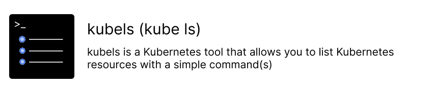
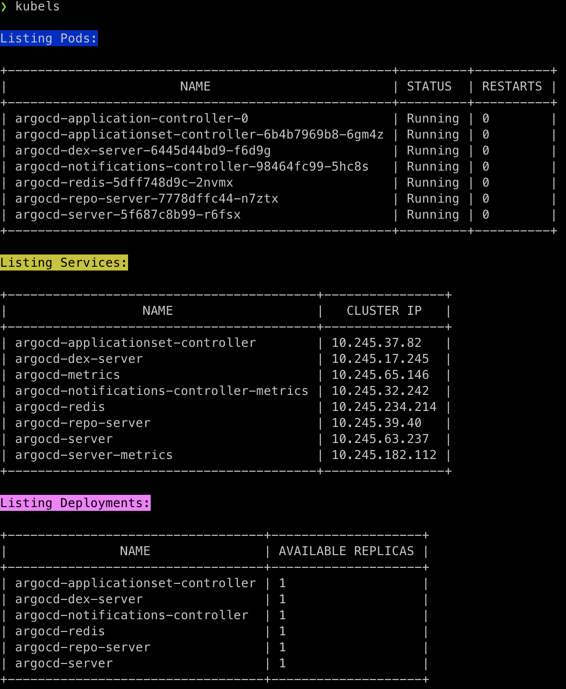
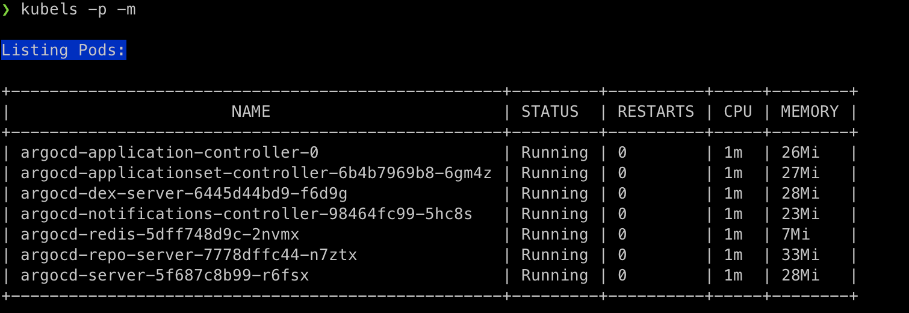

&nbsp;

## Features

#### Listing resources with a simple command :


#### Listing pods + cpu and memory usages with a single command :


## Usage

| Commands                          | Descriptions                                       |
|-----------------------------------|----------------------------------------------------|
| kubels or kubels -p               | list of pods in current namespace                  |     
| kubels -p -n {namespace}          | list of pods in specified namespace                |
| kubels -p -w                      | list of pods in current namespace with watch       |
| kubels -p -o                      | list of pods in current namespace with wide output |
| kubels -p -m                      | list of pods in current namespace with metrics     |
| kubels -n                         | list of namespaces                                 |
| kubels -n {namespace}             | change current namespace with specified namespace  |
| kubels -d                         | list of deployments in current namespace           |
| kubels -d -n {namespace}          | list of deployments in specified namespace         |
| kubels -s                         | list of services in current namespace              |
| kubels -s (or svc) -n {namespace} | list of services in specified namespace            |
| kubels -sec                       | list of secrets in current namespace               |
| kubels -sec -n {namespace}        | list of secrets in specified namespace             |

## Installation

### Homebrew (macOS and Linux)

```bash
brew tap semihtok/kubels

brew install kubels
```


### Chocolatey (Windows)
Coming soon


### Manual Installation 

```bash
git clone
cd kubels
go build -o kubels
mv kubels /usr/local/bin
```


## License
Apache License 2.0, see [LICENSE](LICENSE).

## Contributing
Contributions are welcome! Feel free to open an issue or submit a PR.

## Author
Semih Tok